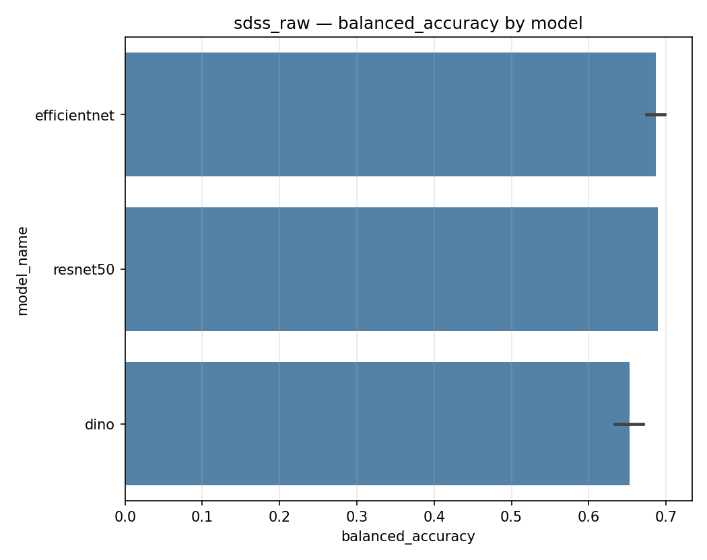
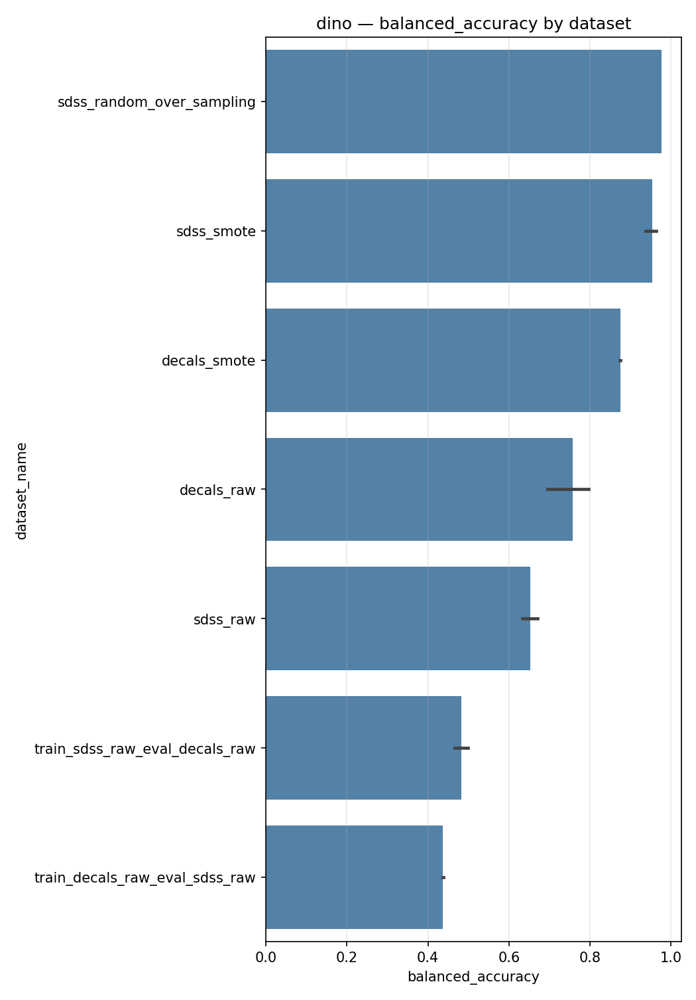
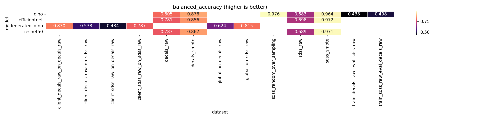
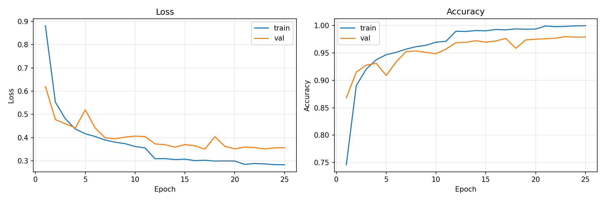
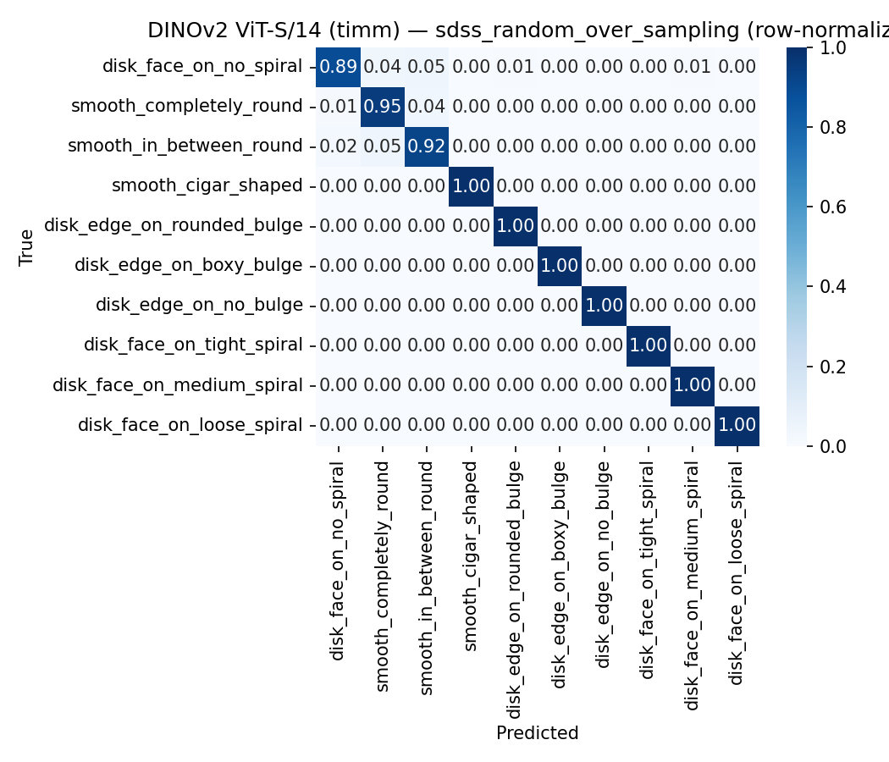
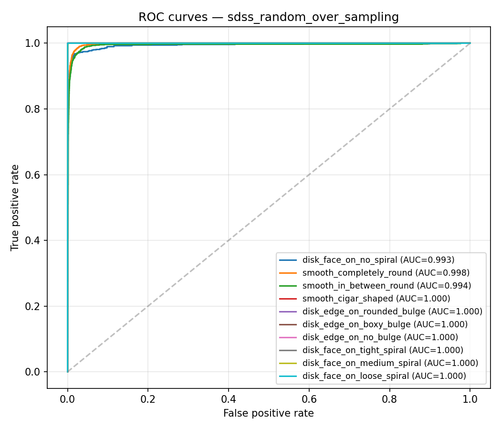
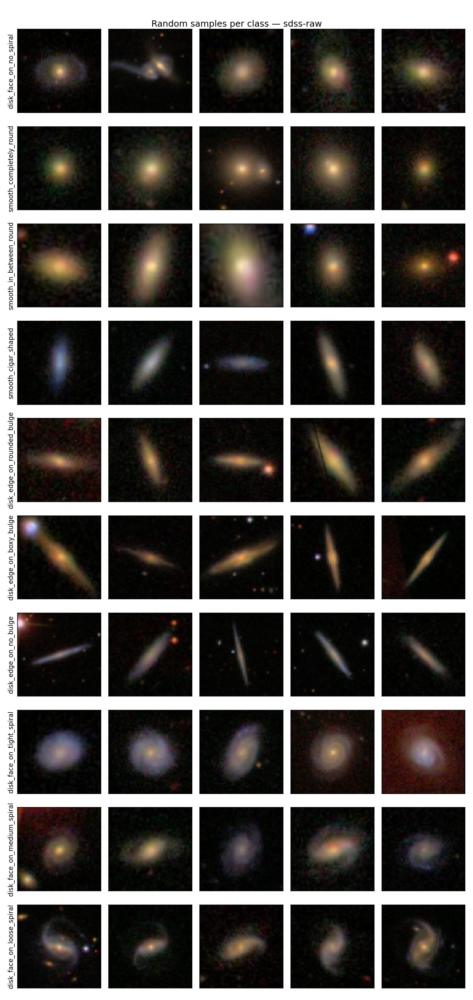
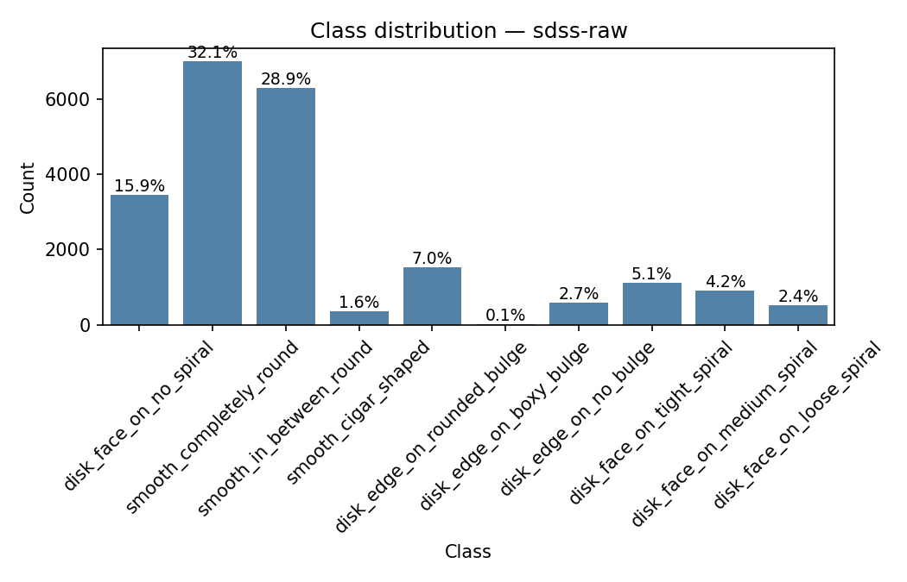
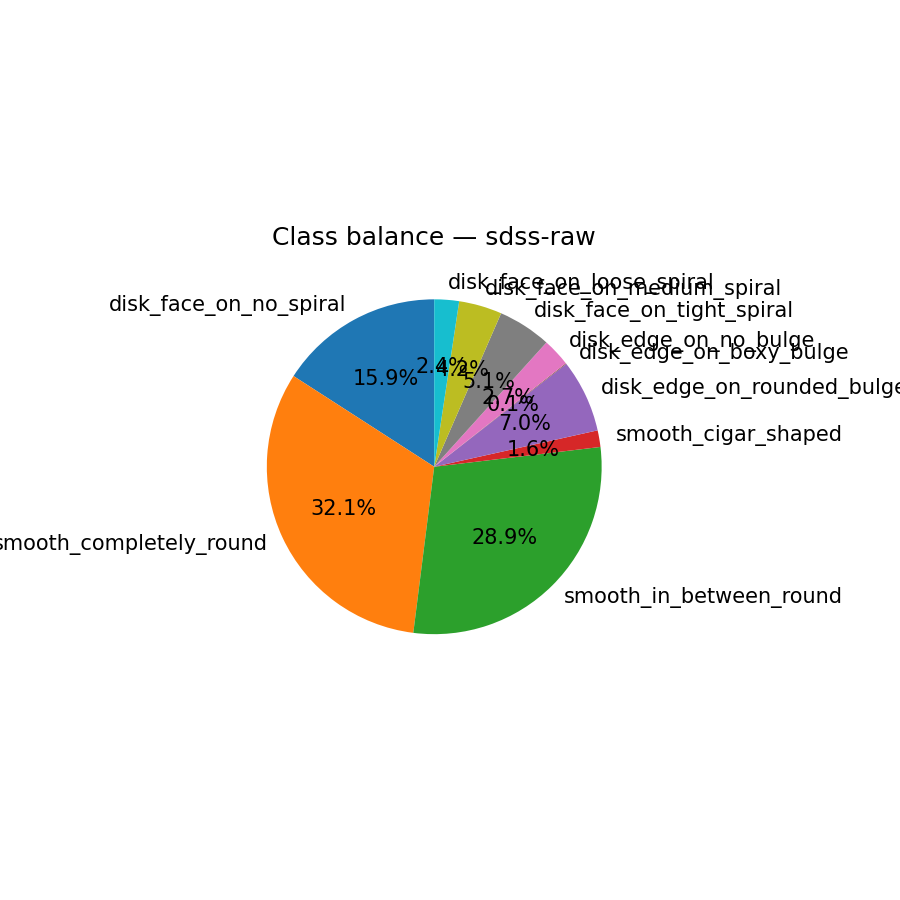
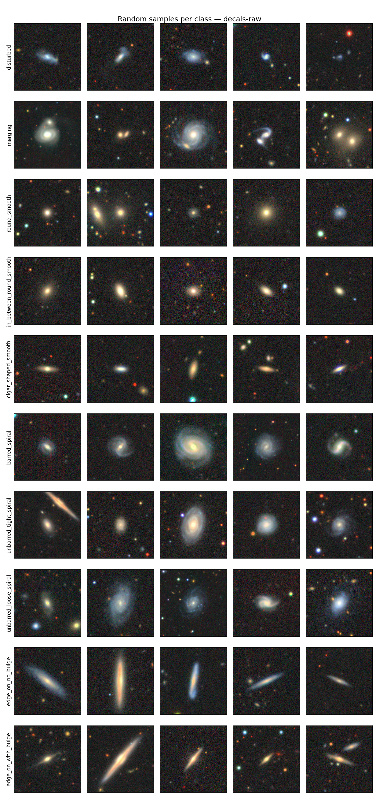

# A Look Outside


[](https://github.com/astral-sh/uv)

-84,27%25-brightgreen)
-97,21%25-yellow)

Classificação morfológica de galáxias com aprendizado profundo, balanceamento de dados, aprendizado federado e explicabilidade visual (XAI).

---

## Visão Geral

| Item | Detalhe |
|---|---|
| **Tarefa** | Classificação morfológica de galáxias (10 classes por survey) |
| **Surveys** | SDSS · DECaLS |
| **Modelos avaliados** | DINOv2 · EfficientNet · ResNet50 · KNN · DINOv2 Federado |
| **Total de runs** | 36 runs · 21 pares (modelo, dataset) únicos |
| **Melhor resultado** | DINOv2 + SDSS (random over-sampling) — balanced accuracy **97,64%** [^leak] |
| **XAI** | Grad-CAM · Exemplos de vizinhos mais próximos |
| **Aprendizado federado** | FedAvg com clientes SDSS e DECaLS |

---

## Resultados Principais

### Protocolo Robusto — datasets naturais (`*_raw`)

> Divisão estratificada train/val/test com balanceamento aplicado **somente no treino**. Esta é a evidência científica principal.

| Modelo | Dataset | Accuracy | Balanced Acc. | Macro F1 | ROC-AUC |
|---|---|---|---|---|---|
| DINOv2 | sdss_raw | 84,21% | 68,29% | 0,6834 | 0,9086 |
| EfficientNet | sdss_raw | 83,41% | 69,85% | 0,6912 | 0,9657 |
| ResNet50 | sdss_raw | 84,27% | 68,95% | 0,6941 | 0,9425 |
| DINOv2 | decals_raw | 81,29% | 80,49% | 0,7958 | 0,9552 |
| ResNet50 | decals_raw | 80,23% | 78,27% | 0,7800 | 0,9690 |
| EfficientNet | decals_raw | 79,71% | 78,10% | 0,7763 | 0,9691 |



### Ablação — datasets processados (`*_smote`, `*_random_over_sampling`)

> Análise do impacto do balanceamento artificial. Validação e teste permanecem naturais, portanto os valores de teste são inflacionados — interpretar como ablação, não como resultado principal.

| Rank | Modelo | Dataset | Balanced Acc. | Macro F1 | ROC-AUC |
|---|---|---|---|---|---|
| 1 | DINOv2 | sdss_random_over_sampling | **97,64%** [^leak] | 0,9763 | 0,9985 |
| 2 | EfficientNet | sdss_smote | 97,21% | 0,9720 | 0,9987 |
| 3 | ResNet50 | sdss_smote | 97,10% | 0,9708 | 0,9985 |
| 4 | DINOv2 | sdss_smote | 96,43% | 0,9640 | 0,9935 |
| 5 | DINOv2 | decals_smote | 87,60% | 0,8759 | 0,9820 |



[^leak]: Run executada antes do patch de 26/05/2026 (commit `1bb9897d`) — o balanceamento foi aplicado ao dataset completo **antes** da divisão treino/validação/teste, vazando informação de validação e teste para o treino. Os valores inflacionados são um limite superior artificial; as runs pós-patch (commit `6d2339f3`, a partir de 26/05/2026) são a evidência válida.

### Cross-Dataset e Aprendizado Federado

| Cenário | Modelo | Balanced Acc. |
|---|---|---|
| Global (treino SDSS+DECaLS) → SDSS | federated_dino | 81,46% |
| Global (treino SDSS+DECaLS) → DECaLS | federated_dino | 62,43% |
| Cliente SDSS → SDSS | federated_dino | 78,72% |
| Cliente DECaLS → DECaLS | federated_dino | 82,99% |
| DINOv2 treino SDSS → avaliação DECaLS | dino | 49,83% |
| DINOv2 treino DECaLS → avaliação SDSS | dino | 43,77% |

### Heatmap Geral — Balanced Accuracy (todos os runs)



---

## Artefatos Entregues

### Arquivos Raiz

| Arquivo | Função |
|---|---|
| `README.md` | Este documento — descrição objetiva de todos os artefatos |
| `config.yaml` | Configuração central do projeto: caminhos, datasets, parâmetros de treino, pipelines, benchmarks, XAI e classes |
| `main.py` | Orquestrador interativo — permite navegar e lançar os módulos de dataset, machine learning e XAI |
| `mise.toml` | Define a versão do Python e comandos padronizados do projeto |
| `pyproject.toml` | Dependências, metadados e ferramentas Python |
| `uv.lock` | Trava as versões resolvidas das dependências para reprodutibilidade |
| `artigo.tex` | Artigo científico do projeto em LaTeX |

### `dataset/` — Leitura e Balanceamento

| Arquivo | Função |
|---|---|
| `dataset/main.py` | CLI interativa para balanceamento: seleciona datasets e métodos via menus |
| `dataset/input_output.py` | Leitura e escrita de datasets no formato H5 (chaves `images` e `ans`) |
| `dataset/analysis.py` | Análise exploratória dos datasets: distribuição de classes, amostras e histogramas de intensidade |
| `dataset/balancing/registry.py` | Registro central dos métodos de balanceamento disponíveis |
| `dataset/balancing/smote.py` | SMOTE para imagens: achata, interpola vizinhos da mesma classe e restaura o formato original |
| `dataset/balancing/random_over_sampling.py` | Duplicação aleatória das classes minoritárias |
| `dataset/balancing/random_under_sampling.py` | Seleção aleatória das classes majoritárias |
| `dataset/balancing/augmentation_*.py` | Métodos de aumento de dados: rotação, flip, brilho, ruído, perspectiva, elástico e combinado |
| `dataset/raw/` | Datasets originais em H5 (não versionados — transferir separadamente) |
| `dataset/processed/` | Datasets balanceados gerados (não versionados — transferir separadamente) |

**Execução:**
```bash
uv run python dataset/main.py
```
CLI interativa — sem parâmetros obrigatórios. Gera arquivos em `dataset/processed/` com nomes como `sdss_smote.h5`, `decals_random_over_sampling.h5`.

---

### `machine-learning/` — Treinamento e Avaliação

| Arquivo | Função |
|---|---|
| `machine-learning/main.py` | CLI interativa para treinamento: seleciona modelos, datasets e pipelines |
| `machine-learning/pipeline.py` | Orquestra o ciclo completo: carregamento, split, balanceamento, treino, avaliação e documentação |
| `machine-learning/data_loading.py` | Carregamento de datasets H5, splits estratificados e DataLoaders |
| `machine-learning/dataset_kind.py` | Utilitário que distingue datasets naturais (`raw`) de processados para aplicar o protocolo correto |
| `machine-learning/metric_computation.py` | Cálculo de métricas: accuracy, balanced accuracy, macro F1, Cohen's Kappa, MCC, ROC-AUC, log loss |
| `machine-learning/run_storage.py` | Persistência de runs: logs, config, checkpoint e métricas em `machine-learning/runs/` |
| `machine-learning/documentation_storage.py` | Geração de relatórios Markdown, matrizes de confusão, curvas de aprendizado e distribuição de classes em `docs/` |
| `machine-learning/leaderboard.py` | Agrega runs de `docs/runs.jsonl` e gera o leaderboard com tabelas e gráficos |
| `machine-learning/leaderboard_cli.py` | CLI para visualizar e atualizar o leaderboard manualmente |
| `machine-learning/cross_dataset.py` | Avaliação cross-dataset: treina em um survey e avalia no outro |
| `machine-learning/cross_dataset_federated.py` | Aprendizado federado FedAvg com clientes SDSS e DECaLS |
| `machine-learning/computer_configuration.py` | Detecta e persiste especificações de hardware em `machine-learning/my-computer.yaml` |
| `machine-learning/manifest.py` | Rastreamento de artefatos produzidos por cada run |
| `machine-learning/text_formatting.py` | Formatação de relatórios e tabelas Markdown |
| `machine-learning/models/registry.py` | Registro central dos modelos disponíveis |
| `machine-learning/models/dino.py` | DINOv2 (ViT-S/14) com fine-tuning diferenciado backbone/cabeça |
| `machine-learning/models/efficientnet.py` | EfficientNet com fine-tuning |
| `machine-learning/models/resnet50.py` | ResNet-50 com fine-tuning |
| `machine-learning/models/vgg16.py` | VGG-16 com fine-tuning |
| `machine-learning/models/k_nearest_neighbors.py` | KNN no espaço de pixels |
| `machine-learning/runs/` | Artefatos brutos de cada run (não versionados — transferir separadamente) |

**Execução:**
```bash
uv run python machine-learning/main.py
```
CLI interativa — sem parâmetros obrigatórios. Os parâmetros de treino são definidos em `config.yaml`.

---

### `benchmark/` — Execução de Benchmarks Declarativos

| Arquivo | Função |
|---|---|
| `benchmark/main.py` | CLI de benchmarks: lê os protocolos definidos em `config.yaml` e executa sequências de experimentos |
| `benchmark/orchestrator.py` | Orquestra a sequência de experimentos de um benchmark |
| `benchmark/dataset_resolution.py` | Resolve os datasets a usar conforme o protocolo do benchmark |
| `benchmark/recommendations.py` | Gera recomendações automáticas com base nos resultados do benchmark |

**Execução:**
```bash
# Interativo — lista os benchmarks disponíveis em config.yaml
uv run python benchmark/main.py

# Direto — especifica o benchmark pelo nome
uv run python benchmark/main.py --benchmark everything

# Sem confirmação interativa
uv run python benchmark/main.py --benchmark robust_full --yes
```

| Parâmetro | Descrição |
|---|---|
| `--benchmark` / `-b` | Nome do benchmark definido em `config.yaml` (ex: `robust_full`, `everything`) |
| `--yes` / `-y` | Executa sem confirmação interativa |

**Benchmarks disponíveis em `config.yaml`:**

| Nome | Descrição |
|---|---|
| `robust_full` | Protocolo principal — SDSS/DECaLS raw com split estratificado e balanceamento apenas no treino |
| `galaxy_full` | Ablação — comparação com datasets processados (raw + SMOTE) |
| `cross_dataset_federated` | DINOv2 cross-dataset SDSS/DECaLS + FedAvg (3 rounds, 1 época local) |
| `everything` | Executa `robust_full` → `galaxy_full` → `cross_dataset_federated` em sequência |

---

### `xai/` — Explicabilidade Visual

| Arquivo | Função |
|---|---|
| `xai/main.py` | CLI interativa para extração de amostras e geração de explicações em lote |
| `xai/sample_extraction.py` | Extrai amostras representativas por classe a partir dos datasets |
| `xai/explanation_generation.py` | Coordena a geração de explicações para cada amostra extraída |
| `xai/artifact_storage.py` | Salva imagens de amostras e explicações em `docs/xai/` |
| `xai/methods/registry.py` | Registro central dos métodos XAI disponíveis |
| `xai/methods/gradient_class_activation_mapping.py` | Grad-CAM: mapas de ativação por gradiente para modelos de deep learning |
| `xai/methods/nearest_neighbors.py` | Exemplos de vizinhos mais próximos para KNN |

**Execução:**
```bash
uv run python xai/main.py
```

**Saída:** `docs/xai/<model-name>/<dataset-name>/`

---

### `docs/` — Resultados e Documentação

Todos os artefatos de documentação são gerados automaticamente pelos módulos `machine-learning/` e `dataset/` e organizados em quatro subárvores:

#### Leaderboard e Registro de Runs

| Artefato | Caminho | Conteúdo |
|---|---|---|
| Leaderboard Markdown | [`docs/leaderboard.md`](docs/leaderboard.md) | Ranking completo de todos os 36 runs por balanced accuracy, com tabelas por modelo e por dataset |
| Leaderboard CSV | [`docs/leaderboard.csv`](docs/leaderboard.csv) | Mesmo ranking em formato tabular para análise externa |
| Registro de runs | [`docs/runs.jsonl`](docs/runs.jsonl) | Fonte primária — uma linha JSON por run, consumida pelo leaderboard |
| Heatmap balanced accuracy | [`docs/leaderboard_balanced_accuracy.png`](docs/leaderboard_balanced_accuracy.png) | Visão geral de todos os pares (modelo × dataset) |
| Heatmaps de outras métricas | `docs/leaderboard_<metric>.png` | accuracy · macro\_f1 · cohen\_kappa · roc\_auc\_macro · mcc · log\_loss |

#### Comparações por Dataset

Cada dataset possui um relatório comparativo entre todos os modelos avaliados nele.

| Dataset | Relatório | Gráfico |
|---|---|---|
| sdss\_raw | [`docs/by_dataset/sdss_raw/comparison.md`](docs/by_dataset/sdss_raw/comparison.md) | [`comparison.png`](docs/by_dataset/sdss_raw/comparison.png) |
| decals\_raw | [`docs/by_dataset/decals_raw/comparison.md`](docs/by_dataset/decals_raw/comparison.md) | [`comparison.png`](docs/by_dataset/decals_raw/comparison.png) |
| sdss\_smote | [`docs/by_dataset/sdss_smote/comparison.md`](docs/by_dataset/sdss_smote/comparison.md) | [`comparison.png`](docs/by_dataset/sdss_smote/comparison.png) |
| sdss\_random\_over\_sampling | [`docs/by_dataset/sdss_random_over_sampling/comparison.md`](docs/by_dataset/sdss_random_over_sampling/comparison.md) | [`comparison.png`](docs/by_dataset/sdss_random_over_sampling/comparison.png) |

#### Comparações por Modelo

Cada modelo possui um relatório comparativo entre todos os datasets em que foi avaliado.

| Modelo | Relatório | Gráfico |
|---|---|---|
| DINOv2 | [`docs/by_model/dino/comparison.md`](docs/by_model/dino/comparison.md) | [`comparison.png`](docs/by_model/dino/comparison.png) |

#### Análise Exploratória dos Datasets

Gerada por `dataset/analysis.py`. Cada dataset possui sua própria subpasta em `docs/dataset/<dataset>/`:

| Artefato | Arquivo | Conteúdo |
|---|---|---|
| Sumário estatístico | `summary.md` | Contagem de amostras, balanceamento, shape |
| Verificação de valores | `value_check.md` | Checagens de integridade (NaN, faixa de pixel, duplicatas) |
| Estatísticas por classe | `class_statistics.csv` | Contagem e proporção de cada classe |
| Distribuição de classes | `class_distribution.png` | Barras de frequência por classe |
| Balanço de classes | `class_balance.png` | Razão entre maior e menor classe |
| Histograma de intensidade | `pixel_intensity_histogram.png` | Distribuição de valores de pixel |
| Mosaico de amostras | `sample_mosaic.png` | Grade de exemplos por classe |

Datasets disponíveis: `sdss-raw/` · `decals-raw/` · `sdss_smote/` · `sdss_random_over_sampling/`

#### Artefatos Detalhados por Run

Gerados por `machine-learning/documentation_storage.py`. Estrutura de pastas:

```
docs/models/<model>/<run-id>/
```

Cada run contém:

| Artefato | Arquivo | Conteúdo |
|---|---|---|
| Sumário | `summary.md` | Configuração, dataset, métricas finais, duração |
| Métricas | `metrics.md` | Accuracy · balanced acc. · F1 · Kappa · MCC · ROC-AUC · log loss |
| Relatório de classificação | `classification_report.md` | Precision, recall e F1 por classe |
| Análise de erros | `error_analysis.md` | Classes mais confundidas e padrões de erro |
| Curvas de aprendizado | `learning_curves.png` | Loss e accuracy por época (treino e validação) |
| Matriz de confusão | `confusion_matrix.png` / `confusion_matrix_normalized.png` | Absoluta e normalizada por linha |
| Curvas ROC | `roc_curves.png` | Uma curva por classe (OvR) |
| Curvas Precision-Recall | `precision_recall_curves.png` | Uma curva por classe |
| Acurácia por classe | `per_class_accuracy.png` | Barras de acurácia individual por classe |
| Gráfico de calibração | `calibration_plot.png` | Confiança prevista vs. acurácia real |
| Distribuição de classes | `class_distribution.png` | Split treino/val/teste por classe |

Runs versionados atualmente em `docs/models/`:

| Run | Modelo | Dataset | Validade |
|---|---|---|---|
| `dino-sdss_raw-10-05-2026-sdss_raw` | DINOv2 | sdss\_raw | ⚠ pré-patch [^leak] |
| `dino-decals_raw-10-05-2026-decals_raw` | DINOv2 | decals\_raw | ⚠ pré-patch [^leak] |
| `dino-sdss_smote-10-05-2026-sdss_smote` | DINOv2 | sdss\_smote | ⚠ pré-patch [^leak] |
| `dino-sdss_random_over_sampling-10-05-2026-2-sdss_random_over_sampling` | DINOv2 | sdss\_random\_over\_sampling | ⚠ pré-patch [^leak] |

> Os demais runs (EfficientNet, ResNet50, KNN, federado) estão registrados em `docs/runs.jsonl` e no leaderboard, mas seus artefatos de imagem/relatório não estão versionados — consultar `machine-learning/runs/` na pasta de entrega.

#### Exemplo — DINOv2 + SDSS random over-sampling (melhor run, balanced accuracy 97,64%)

**Curvas de aprendizado**



**Matriz de confusão normalizada**



**Curvas ROC por classe**



---

## Datasets

Os arquivos originais devem ser colocados em:

```
dataset/raw/sdss.h5
dataset/raw/decals.h5
```

Cada arquivo H5 contém as chaves:

| Chave | Descrição |
|---|---|
| `images` | Array de imagens do survey |
| `ans` | Rótulos inteiros das classes morfológicas |

### Classes por Survey

**SDSS** (10 classes):

| ID | Classe |
|---|---|
| 0 | disk_face_on_no_spiral |
| 1 | smooth_completely_round |
| 2 | smooth_in_between_round |
| 3 | smooth_cigar_shaped |
| 4 | disk_edge_on_rounded_bulge |
| 5 | disk_edge_on_boxy_bulge |
| 6 | disk_edge_on_no_bulge |
| 7 | disk_face_on_tight_spiral |
| 8 | disk_face_on_medium_spiral |
| 9 | disk_face_on_loose_spiral |







**DECaLS** (10 classes):

| ID | Classe |
|---|---|
| 0 | disturbed |
| 1 | merging |
| 2 | round_smooth |
| 3 | in_between_round_smooth |
| 4 | cigar_shaped_smooth |
| 5 | barred_spiral |
| 6 | unbarred_tight_spiral |
| 7 | unbarred_loose_spiral |
| 8 | edge_on_no_bulge |
| 9 | edge_on_with_bulge |



---

## Configuração Principal (`config.yaml`)

Os parâmetros centrais do projeto são definidos em `config.yaml`. Os mais relevantes:

| Seção | Parâmetro | Valor padrão | Descrição |
|---|---|---|---|
| `training` | `epoch_count` | 50 | Número máximo de épocas |
| `training` | `early_stopping_patience` | 8 | Paciência do early stopping |
| `training` | `batch_size` | 32 | Tamanho do batch |
| `training` | `image_size` | 224 | Resolução de entrada (pixels) |
| `training` | `random_seed` | 42 | Semente aleatória para reprodutibilidade |
| `training` | `learning_rate` | 1e-4 | Taxa de aprendizado |
| `split_ratios` | `train` / `validation` / `test` | 70% / 15% / 15% | Divisão estratificada |
| `training_balance` | `apply_to` | `train_only` | Balanceamento aplicado somente ao treino |
| `models.dino` | `model_name` | `vit_small_patch14_dinov2` | Backbone DINOv2 |

---

## Reprodução do Ambiente

```bash
# Instalar dependências de ambiente
mise install

# Instalar dependências Python
uv sync

# Verificar instalação
uv run python main.py --help
```

Os arquivos `mise.toml`, `pyproject.toml` e `uv.lock` garantem reprodutibilidade do ambiente Python.

---

## Artefatos Não Versionados

Os itens abaixo não estão no repositório Git por serem grandes demais, mas devem estar incluídos na pasta de entrega:

| Caminho | Conteúdo |
|---|---|
| `dataset/raw/` | Datasets originais SDSS e DECaLS (`.h5`) |
| `dataset/processed/` | Datasets balanceados gerados (`.h5`) |
| `machine-learning/runs/` | Checkpoints, logs e métricas brutas de cada run |
| `docs/models/` | Relatórios detalhados de todos os 36 runs |
