# Analise Consolidada dos Modelos

**Escopo:** consolidacao dos resultados em `docs/` e metadados de runs em `pesos/`, ignorando checkpoints `.pth`.
**Fontes principais:** `pesos/*/*.json`, `pesos/*/historico_runs.jsonl`, `docs/*/*.log`, `docs/vgg16/benchmarks/*.md`, `docs/vgg16/benchmarks/resultados.json`.
**Convencao:** todos os tempos estao em horas. `Epoca melhor ckpt` vem dos JSONs individuais; `Epocas treinadas` vem do historico/log.

## Indice

- [Ranking geral](#ranking-geral)
- [VGG16](#vgg16)
- [ResNet50](#resnet50)
- [EfficientNet-B0](#efficientnet-b0)
- [CNN](#cnn)
- [DINO](#dino)
- [ViT](#vit)
- [Analise dos 3 melhores modelos](#analise-dos-3-melhores-modelos)
- [Benchmarks VGG16 x datasets](#benchmarks-vgg16-x-datasets)
- [Totalizadores de tempo](#totalizadores-de-tempo)

## Ranking geral

| # | Modelo | Melhor run | Dataset | val_acc | Epoca melhor ckpt | Epocas treinadas | Tempo melhor run |
|---:|---|---|---|---:|---:|---:|---:|
| 1 | VGG16 | `vgg16_sdss_hibrido_ep50_20260502_221730` | sdss/hibrido | **96.70%** | 47 | 50 | 8.90 h |
| 2 | ResNet50 | `resnet50_sdss_hibrido_ep50_20260502_190810` | sdss/hibrido | **96.45%** | 50 | 50 | 3.15 h |
| 3 | EfficientNet-B0 | `efficientnet_sdss_raw_ep50_20260501_171440` | sdss/raw | **87.82%** | 14 | 24 | 0.26 h |
| 4 | CNN | `cnn_sdss_raw_ep50_20260501_133405` | sdss/raw | **86.59%** | 43 | 50 | 2.03 h |
| 5 | DINO | `dino_sdss_raw_ep50_20260502_153436` | sdss/raw | **85.61%** | 44 | 44 | 2.76 h |
| 6 | ViT | `vit_sdss_raw_ep50_20260501_202722` | sdss/raw | **85.55%** | 37 | 47 | 2.03 h |

O ranking antigo em `analise-2.md` colocava DINO com 82.71%; os JSONs atuais em `pesos/dino/` registram um run posterior com 85.61%, usado aqui como fonte mais completa.

## VGG16

**Resumo:** melhor acuracia global do projeto, com ganho forte no SDSS/hibrido. Tambem e o unico modelo com matriz de confusao e benchmark completo entre SDSS, DECaLS e fusao.

| Execucao | Dataset | val_acc | Epoca melhor ckpt | Epocas treinadas | Early stop | Tempo | Timestamp |
|---|---|---:|---:|---:|---|---:|---|
| `vgg16_sdss_raw_ep50_20260501_173036` | sdss/raw | 89.38% | 41 | 50 | nao | 2.78 h | 2026-05-01T20:27:22 |
| `vgg16_sdss_hibrido_ep50_20260502_221730` | sdss/hibrido | **96.70%** | 47 | 50 | nao | 8.90 h | 2026-05-03T07:11:24 |
| `vgg16_decals_raw_ep50_20260504_000207` | decals/raw | 87.07% | 31 | 36 | sim | 1.59 h | 2026-05-04T01:37:32 |
| `vgg16_fusao_raw_ep50_20260504_013732` | fusao/raw | 87.01% | 26 | 31 | sim | 3.02 h | 2026-05-04T04:38:43 |

**Tempo total do modelo:** 16.29 h em 4 runs.

### Parametros principais

| Parametro | sdss/raw | sdss/hibrido | decals/raw | fusao/raw |
|---|---:|---:|---:|---:|
| `batch_size` | 16 | 16 | 16 | 16 |
| `lr_cabeca` | 1e-3 | 1e-3 | 1e-3 | 1e-3 |
| `lr_backbone` | 1e-4 | 1e-4 | 1e-4 | 1e-4 |
| `epocas_congelado` | 5 | 5 | 5 | 5 |
| `paciencia_early_stop` | 10 | 5 | 5 | 5 |
| `label_smoothing` | - | 0.05 | 0.05 | 0.05 |
| `distilacao_temperatura` | - | 4.0 | 4.0 | 4.0 |
| `distilacao_alpha` | - | 0.7 | 0.7 | 0.7 |

### Convergencia

No SDSS/hibrido, o Stage 1 chega a 81.92% na epoca 5. Apos liberar o backbone, o modelo sobe para 82.82% na epoca 6, passa de 94% perto da epoca 25 e atinge o melhor checkpoint na epoca 47. O final do treino fica em plateau, com 96.62% na epoca 50.

No DECaLS/raw e fusao/raw, o treino para cedo por paciencia. O DECaLS atinge 87.07% no checkpoint da epoca 31 e encerra na epoca 36; a fusao atinge 87.01% no checkpoint da epoca 26 e encerra na epoca 31.

### Imagens do modelo

| Classe | XAI |
|---:|---|
| 00 |  |
| 01 |  |
| 02 |  |
| 03 |  |
| 04 |  |
| 05 |  |
| 06 |  |
| 07 |  |
| 08 |  |
| 09 |  |

## ResNet50

**Resumo:** segundo melhor modelo em acuracia, muito proximo do VGG16, mas com tempo bem menor no run hibrido.

| Execucao | Dataset | val_acc | Epoca melhor ckpt | Epocas treinadas | Early stop | Tempo | Timestamp |
|---|---|---:|---:|---:|---|---:|---|
| `resnet50_sdss_raw_ep50_20260501_164415` | sdss/raw | 90.08% | 17 | 27 | sim | 0.49 h | 2026-05-01T17:14:40 |
| `resnet50_sdss_hibrido_ep50_20260502_190810` | sdss/hibrido | **96.45%** | 50 | 50 | nao | 3.15 h | 2026-05-02T22:17:30 |

**Tempo total do modelo:** 3.64 h em 2 runs.

### Parametros principais

| Parametro | sdss/raw | sdss/hibrido |
|---|---:|---:|
| `batch_size` | 32 | 32 |
| `lr_cabeca` | 1e-3 | 1e-3 |
| `lr_backbone` | 1e-4 | 5e-5 |
| `epocas_congelado` | 5 | 5 |
| `paciencia_early_stop` | 10 | 10 |
| `label_smoothing` | - | 0.1 |

### Convergencia

O raw chega a 90.08% na epoca 17 e encerra por early stop na epoca 27. O hibrido continua melhorando ate a epoca 50, quando tambem registra o melhor checkpoint. A queda do `lr_backbone` e o `label_smoothing=0.1` parecem ter ajudado a manter estabilidade no dataset hibrido.

### Imagens do modelo

| Classe | XAI |
|---:|---|
| 00 |  |
| 01 | 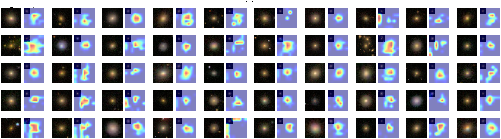 |
| 02 | 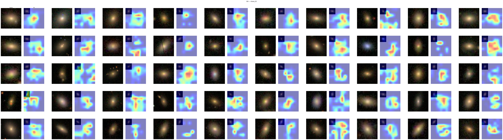 |
| 03 | 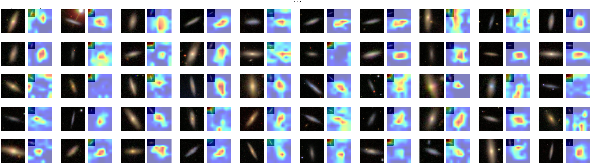 |
| 04 | 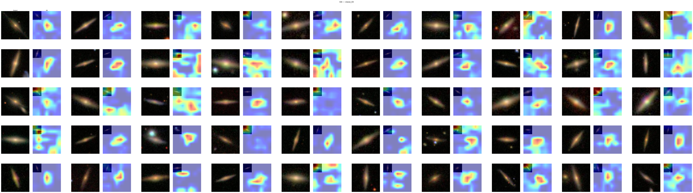 |
| 05 | 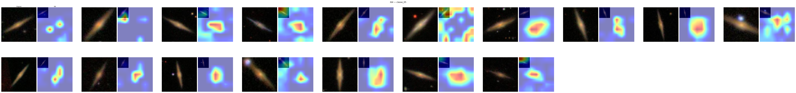 |
| 06 | 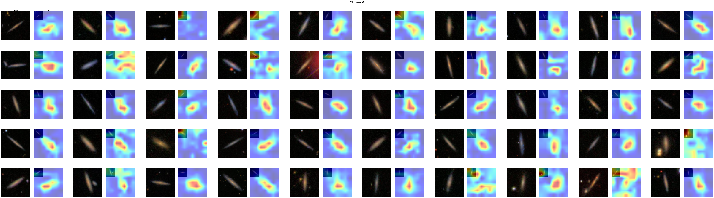 |
| 07 | 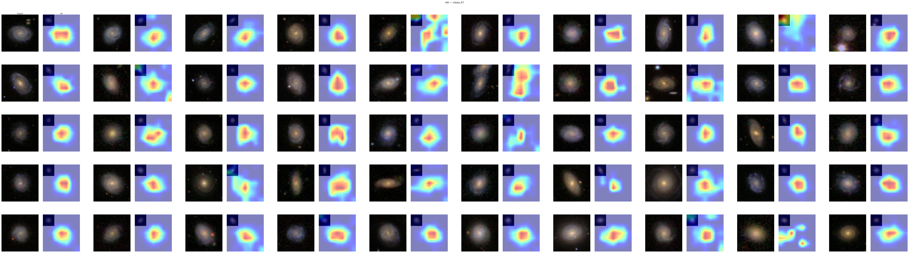 |
| 08 | 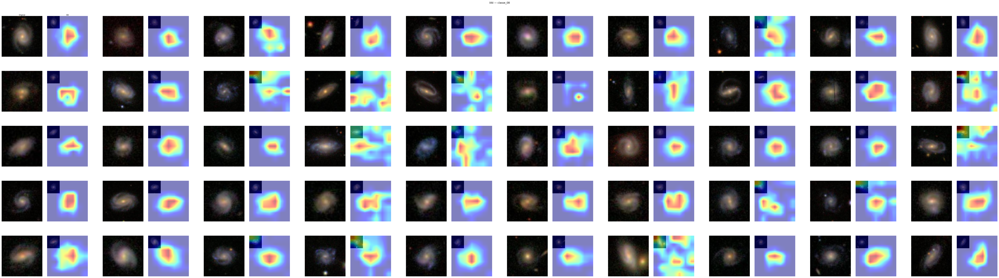 |
| 09 | 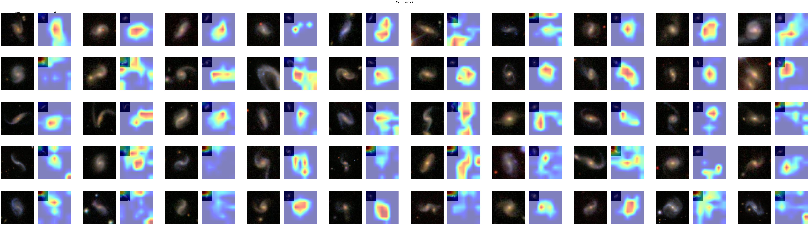 |

## EfficientNet-B0

**Resumo:** melhor eficiencia por tempo. Nao ha run hibrido salvo em `pesos/`, entao a comparacao direta com VGG16 e ResNet50 ainda fica limitada ao raw.

| Execucao | Dataset | val_acc | Epoca melhor ckpt | Epocas treinadas | Early stop | Tempo | Timestamp |
|---|---|---:|---:|---:|---|---:|---|
| `efficientnet_sdss_raw_ep50_20260501_171440` | sdss/raw | **87.82%** | 14 | 24 | sim | 0.26 h | 2026-05-01T17:30:36 |

**Tempo total do modelo:** 0.26 h em 1 run.

### Parametros principais

`seed=42`, `batch_size=32`, `tamanho_imagem=224`, `variante_backbone=efficientnet_b0`, `lr_cabeca=1e-3`, `lr_backbone=1e-4`, `epocas_congelado=5`, `pretrained=true`, `paciencia_early_stop=10`, `scheduler_ativo=true`, `peso_decay=1e-4`.

### Convergencia

O modelo sobe rapido no Stage 2, atinge 87.82% na epoca 14 e encerra na epoca 24 por early stop. E o candidato natural para um run `sdss/hibrido`, porque o custo esperado e baixo frente aos demais modelos.

### Imagens do modelo

Nao foram encontradas imagens XAI para EfficientNet em `docs/`.

## CNN

**Resumo:** baseline convolucional treinado em SDSS/raw. Fica abaixo dos melhores modelos de transfer learning, mas acima de ViT e DINO nos runs raw antigos.

| Execucao | Dataset | val_acc | Epoca melhor ckpt | Epocas treinadas | Early stop | Tempo | Timestamp |
|---|---|---:|---:|---:|---|---:|---|
| `cnn_sdss_raw_ep50_20260501_133405` | sdss/raw | **86.59%** | 43 | 50 | nao | 2.03 h | 2026-05-01T14:42:07 |
| `cnn_sdss_raw_ep50_20260501_153718` | sdss/raw | **86.59%** | 43 | 50 | nao | 1.09 h | 2026-05-01T16:44:15 |

**Tempo total do modelo:** 3.12 h em 2 runs.

### Parametros principais

`seed=42`, `batch_size=32`, `tamanho_imagem=224`, `lr=1e-3`, `paciencia_early_stop=10`, `scheduler_ativo=true`, `peso_decay=1e-4`, `dataset=sdss`, `versao_dataset=raw`.

### Convergencia

Os dois runs chegam ao mesmo melhor `val_acc` de 86.59% e treinam as 50 epocas. O checkpoint de melhor desempenho fica na epoca 43.

### Imagens do modelo

Nao foram encontradas imagens XAI para CNN em `docs/`.

## DINO

**Resumo:** tem um bom run raw, mas falha no SDSS/hibrido, ficando preso no baseline de 10 classes.

| Execucao | Dataset | val_acc | Epoca melhor ckpt | Epocas treinadas | Early stop | Tempo | Timestamp |
|---|---|---:|---:|---:|---|---:|---|
| `dino_sdss_raw_ep50_20260502_144916` | sdss/raw | 64.13% | 5 | 5 | nao | 0.66 h | 2026-05-02T15:08:04 |
| `dino_sdss_raw_ep50_20260502_153436` | sdss/raw | **85.61%** | 44 | 44 | nao | 2.76 h | 2026-05-02T18:20:18 |
| `dino_sdss_hibrido_ep50_20260503_071125` | sdss/hibrido | 10.00% | 1 | 11 | sim | 2.52 h | 2026-05-03T09:42:29 |
| `dino_sdss_hibrido_ep50_20260503_123447` | sdss/hibrido | 10.00% | 1 | 11 | sim | 2.02 h | 2026-05-03T14:35:59 |

**Tempo total do modelo:** 7.96 h em 4 runs.

### Parametros principais

| Parametro | raw melhor | hibrido |
|---|---:|---:|
| `modo` | hub | hub |
| `backbone` | dinov2_vitb14 | dinov2_vitb14 |
| `batch_size` | 32 | 32 |
| `lr_cabeca` | 1e-3 | 1e-3 |
| `lr_backbone` | 1e-5 | 5e-6 |
| `epocas_congelado` | 5 | 5 |
| `label_smoothing` | - | 0.1 |
| `cabeca_mlp` | - | true |

### Convergencia

O melhor raw melhora de forma gradual ate a epoca 44, com 85.61%. Os dois runs hibridos ficam em `val_acc ~= 0.1000`, `loss ~= 2.3026` e encerram por early stop apos 11 epocas. Isso indica falha especifica da configuracao DINO no hibrido, possivelmente ligada a `cabeca_mlp=true`, ao LR menor do backbone ou ao carregamento desse dataset no pipeline.

### Imagens do modelo

| Classe | XAI |
|---:|---|
| 00 |  |
| 01 | 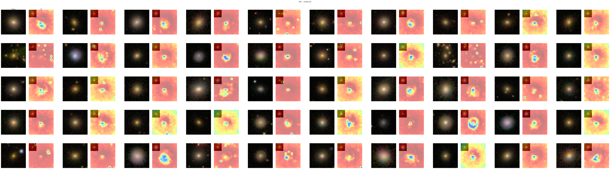 |
| 02 | 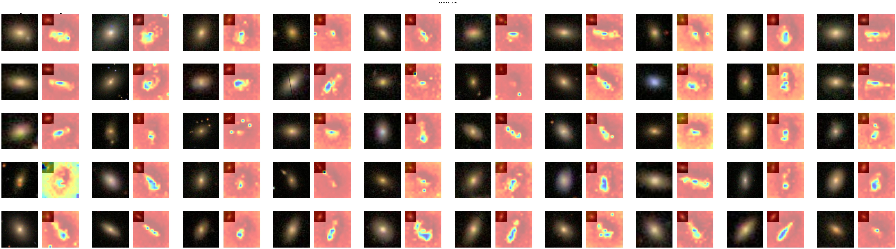 |
| 03 | 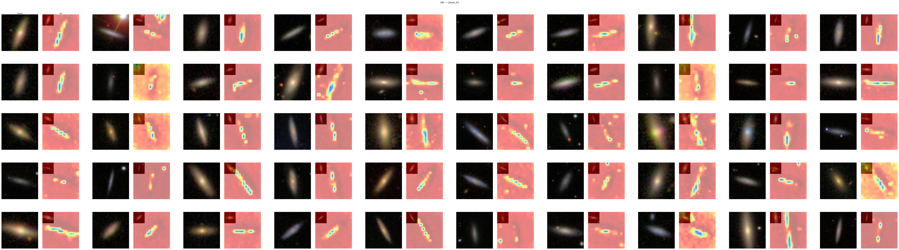 |
| 04 | 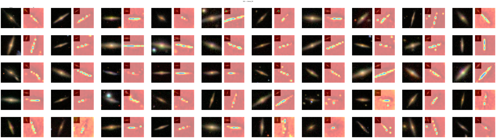 |
| 05 | 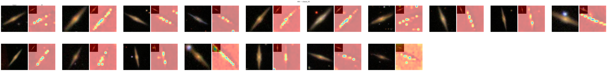 |
| 06 | 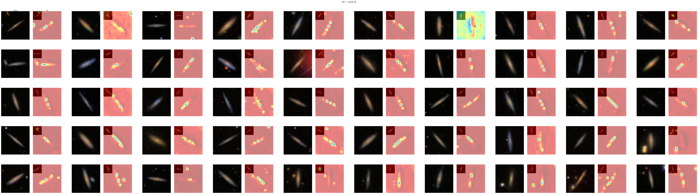 |
| 07 | 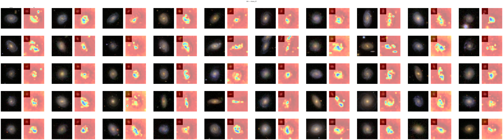 |
| 08 | 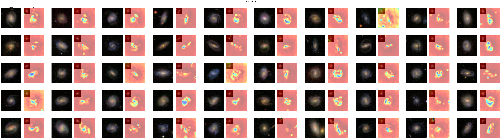 |
| 09 | 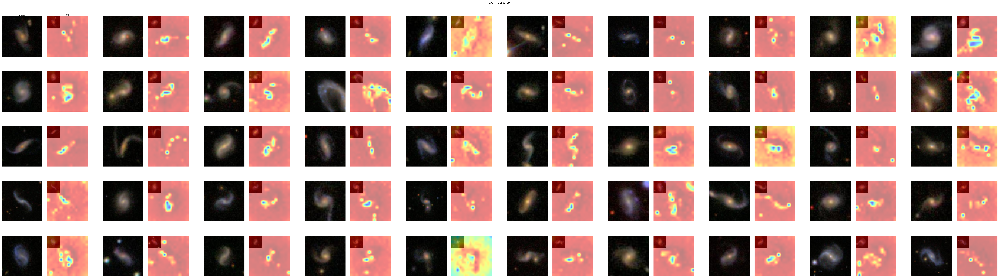 |

## ViT

**Resumo:** desempenho praticamente empatado com o melhor DINO raw, mas com custo menor que DINO e maior que EfficientNet.

| Execucao | Dataset | val_acc | Epoca melhor ckpt | Epocas treinadas | Early stop | Tempo | Timestamp |
|---|---|---:|---:|---:|---|---:|---|
| `vit_sdss_raw_ep50_20260501_202722` | sdss/raw | **85.55%** | 37 | 47 | sim | 2.03 h | 2026-05-01T22:33:58 |

**Tempo total do modelo:** 2.03 h em 1 run.

### Parametros principais

`seed=42`, `batch_size=32`, `tamanho_imagem=224`, `backbone=vit_base_patch16_224`, `lr_cabeca=1e-3`, `lr_backbone=1e-5`, `epocas_congelado=10`, `pretrained=true`, `paciencia_early_stop=10`, `scheduler_ativo=true`, `peso_decay=1e-4`.

### Convergencia

O checkpoint de melhor validacao aparece na epoca 37 e o treino encerra por early stop na epoca 47. Nao ha run hibrido registrado para ViT em `pesos/`.

### Imagens do modelo

Nao foram encontradas imagens XAI para ViT em `docs/`.

---

## Analise dos 3 melhores modelos

### Comparativo direto

| Modelo | Melhor dataset | val_acc | Tempo melhor run | Tempo total modelo | Eficiencia do melhor run |
|---|---|---:|---:|---:|---:|
| VGG16 | sdss/hibrido | **96.70%** | 8.90 h | 16.29 h | 10.87 pp/h |
| ResNet50 | sdss/hibrido | 96.45% | 3.15 h | 3.64 h | **30.62 pp/h** |
| EfficientNet-B0 | sdss/raw | 87.82% | 0.26 h | 0.26 h | **337.77 pp/h** |

### Leitura

VGG16 e o melhor em acuracia absoluta, mas custa quase 3x o tempo do ResNet50 no hibrido. A diferenca de acuracia entre os dois e pequena: 0.25 ponto percentual.

ResNet50 tem o melhor custo-beneficio entre os modelos de alta acuracia. O run hibrido chega a 96.45% em 3.15 h e nao dispara early stop, sinal de que ainda estava aproveitando o treino ate a epoca 50.

EfficientNet-B0 e o mais eficiente por hora, mas ainda nao foi testado no SDSS/hibrido. Como VGG16 e ResNet50 ganharam muito com o hibrido, EfficientNet e o proximo experimento mais informativo.

### Impacto do hibrido

| Modelo | Raw | Hibrido | Ganho |
|---|---:|---:|---:|
| VGG16 | 89.38% | **96.70%** | +7.32 pp |
| ResNet50 | 90.08% | **96.45%** | +6.37 pp |
| DINO | 85.61% | 10.00% | -75.61 pp |

O hibrido e decisivo para VGG16 e ResNet50, mas quebra o pipeline DINO nas duas execucoes registradas.

## Benchmarks VGG16 x datasets

**Modelos avaliados:** T1 (SDSS/raw), T2 (SDSS/hibrido), T3 (DECaLS/raw), T4 (fusao), T5 (fine-tune T2 -> fusao).
**Tempo da avaliacao mais recente:** 0.54 h, extraido de `docs/vgg_datasets.log` entre 2026-05-04 05:11:46 e 05:44:08.

### Treinos in-distribution

| ID | Descricao | Dataset treino | acc | Precision macro | Recall macro | F1 macro |
|---|---|---|---:|---:|---:|---:|
| t1 | VGG16 treina SDSS/raw | sdss/raw | 0.8838 | 0.7741 | 0.7491 | 0.7600 |
| t2 | VGG16 treina SDSS/hibrido | sdss/hibrido | **0.9679** | 0.9676 | 0.9679 | 0.9677 |
| t3 | VGG16 treina DECaLS/raw | decals/raw | 0.8512 | 0.8242 | 0.8349 | 0.8268 |
| t4 | VGG16 treina fusao | fusao/raw | 0.8689 | 0.8604 | 0.8601 | 0.8592 |
| t5 | Fine-tune T2 -> fusao | fusao/raw | 0.8689 | 0.8604 | 0.8601 | 0.8592 |

### Matriz cross-dataset

Diagonal = avaliacao in-distribution em split de teste. Fora da diagonal = generalizacao cross-dataset em dataset completo.

| Treino \ Avaliacao | SDSS | DECaLS | Fusao |
|---|---:|---:|---:|
| SDSS/raw | **0.8838** | 0.0520 | 0.5471 |
| SDSS/hibrido | **0.9679** | 0.0843 | 0.5744 |
| DECaLS/raw | 0.0638 | **0.8512** | 0.4459 |
| fusao/raw | 0.9162 | 0.9071 | **0.8689** |
| FT -> fusao | 0.9162 | 0.9071 | **0.8689** |

### Gap de generalizacao

| Treino | In-dist acc | Melhor cross acc | Gap |
|---|---:|---:|---:|
| t1 (sdss/raw) | 0.8838 | 0.5471 | +0.3367 |
| t2 (sdss/hibrido) | 0.9679 | 0.5744 | +0.3935 |
| t3 (decals/raw) | 0.8512 | 0.4459 | +0.4053 |
| t4 (fusao/raw) | 0.8689 | 0.9162 | -0.0472 |
| t5 (fusao/raw) | 0.8689 | 0.9162 | -0.0472 |

### Impacto do fine-tuning

| Avaliacao | T2 (SDSS/hibrido) | T5 (FT -> fusao) | Delta |
|---|---:|---:|---:|
| SDSS completo | 0.9679 | 0.9162 | -0.0517 |
| DECaLS completo | 0.0843 | 0.9071 | +0.8228 |
| Fusao completo/test split | 0.5744 | 0.8689 | +0.2945 |

### Detalhes dos benchmarks

| Arquivo | Descricao | Modo | Eval | Acc | Precision | Recall | F1 |
|---|---|---|---|---:|---:|---:|---:|
| `t1_t1.md` | T1 val SDSS/raw | split | sdss | 0.8838 | 0.7741 | 0.7491 | 0.7600 |
| `t2_t2.md` | T2 val SDSS/hibrido | split | sdss | 0.9679 | 0.9676 | 0.9679 | 0.9677 |
| `t3_t3.md` | T3 val DECaLS/raw | split | decals | 0.8512 | 0.8242 | 0.8349 | 0.8268 |
| `t4_t4.md` | T4 val fusao | split | fusao | 0.8689 | 0.8604 | 0.8601 | 0.8592 |
| `t5_t5.md` | T5 val fusao (FT) | split | fusao | 0.8689 | 0.8604 | 0.8601 | 0.8592 |
| `t1_c1.md` | T1 -> DECaLS completo | full | decals | 0.0520 | 0.0344 | 0.0667 | 0.0377 |
| `t1_c2.md` | T1 -> fusao completo | full | fusao | 0.5471 | 0.5433 | 0.4278 | 0.4100 |
| `t2_c3.md` | T2 -> DECaLS completo | full | decals | 0.0843 | 0.0516 | 0.1190 | 0.0583 |
| `t2_c4.md` | T2 -> fusao completo | full | fusao | 0.5744 | 0.5654 | 0.4566 | 0.4348 |
| `t3_c5.md` | T3 -> SDSS completo | full | sdss | 0.0638 | 0.1679 | 0.0367 | 0.0418 |
| `t3_c6.md` | T3 -> fusao completo | full | fusao | 0.4459 | 0.5916 | 0.5457 | 0.5036 |
| `t4_c7.md` | T4 -> SDSS completo | full | sdss | 0.9162 | 0.8014 | 0.8038 | 0.8021 |
| `t4_c8.md` | T4 -> DECaLS completo | full | decals | 0.9071 | 0.9010 | 0.8903 | 0.8880 |
| `t5_c9.md` | T5 -> SDSS completo | full | sdss | 0.9162 | 0.8014 | 0.8038 | 0.8021 |
| `t5_c10.md` | T5 -> DECaLS completo | full | decals | 0.9071 | 0.9010 | 0.8903 | 0.8880 |

### Conclusao dos benchmarks

O SDSS/hibrido e o melhor in-distribution, mas generaliza mal para DECaLS e fusao. A fusao e a configuracao mais robusta para cross-dataset: mesmo com acuracia in-distribution menor que T2, ela chega a 91.62% no SDSS completo e 90.71% no DECaLS completo.

## Totalizadores de tempo

### Treino por modelo

| Modelo | Runs | Tempo total |
|---|---:|---:|
| VGG16 | 4 | **16.29 h** |
| DINO | 4 | 7.96 h |
| ResNet50 | 2 | 3.64 h |
| CNN | 2 | 3.12 h |
| ViT | 1 | 2.03 h |
| EfficientNet-B0 | 1 | 0.26 h |
| **Total treino** | **14** | **33.30 h** |

### Avaliacoes e pipelines auxiliares

| Pipeline | Descricao | Tempo |
|---|---|---:|
| VGG16 x datasets | ultima avaliacao completa T1-T5, split + full | 0.54 h |
| **Total treino + avaliacao registrada** | soma do treino com a avaliacao mais recente | **33.84 h** |

Os tempos de treino foram somados por run salvo em `pesos/`. A avaliacao VGG16 x datasets fica separada porque nao e treino novo de modelo; ela usa checkpoints existentes e gera os relatorios `docs/vgg16/benchmarks/*.md`.
