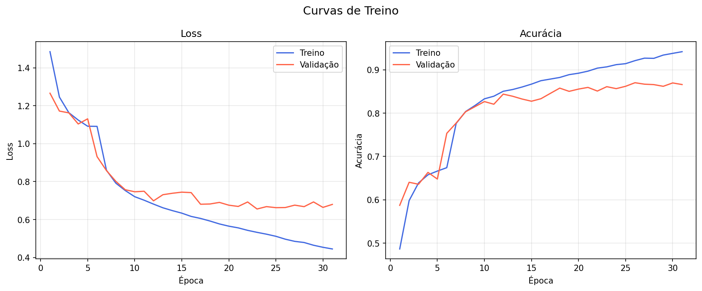
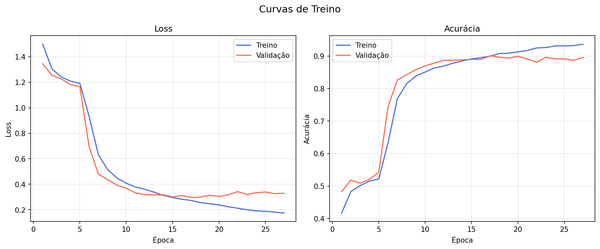
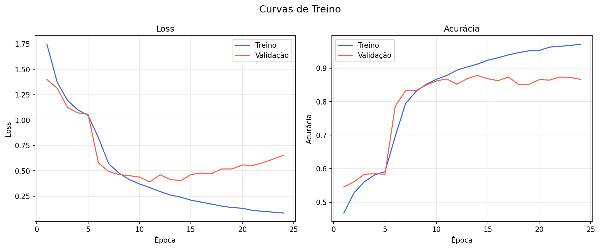
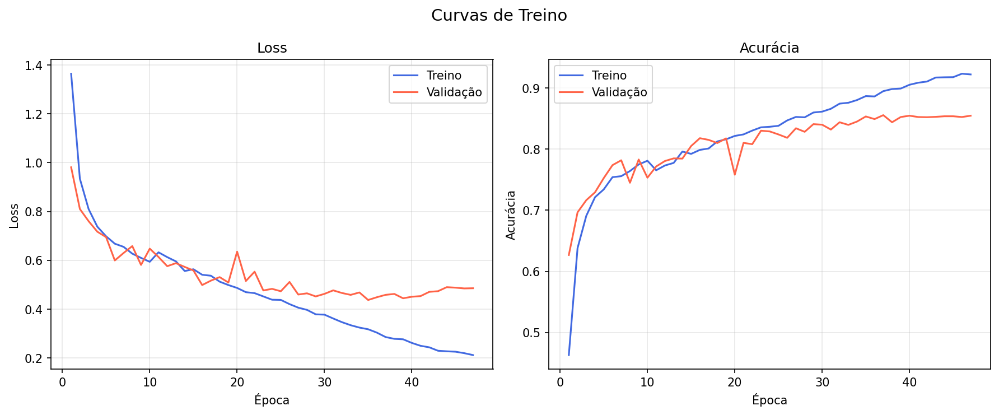
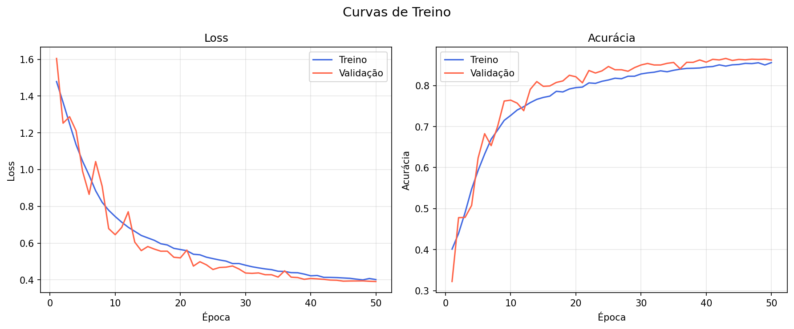
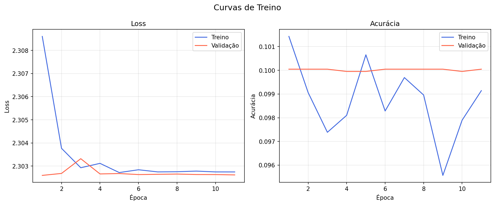
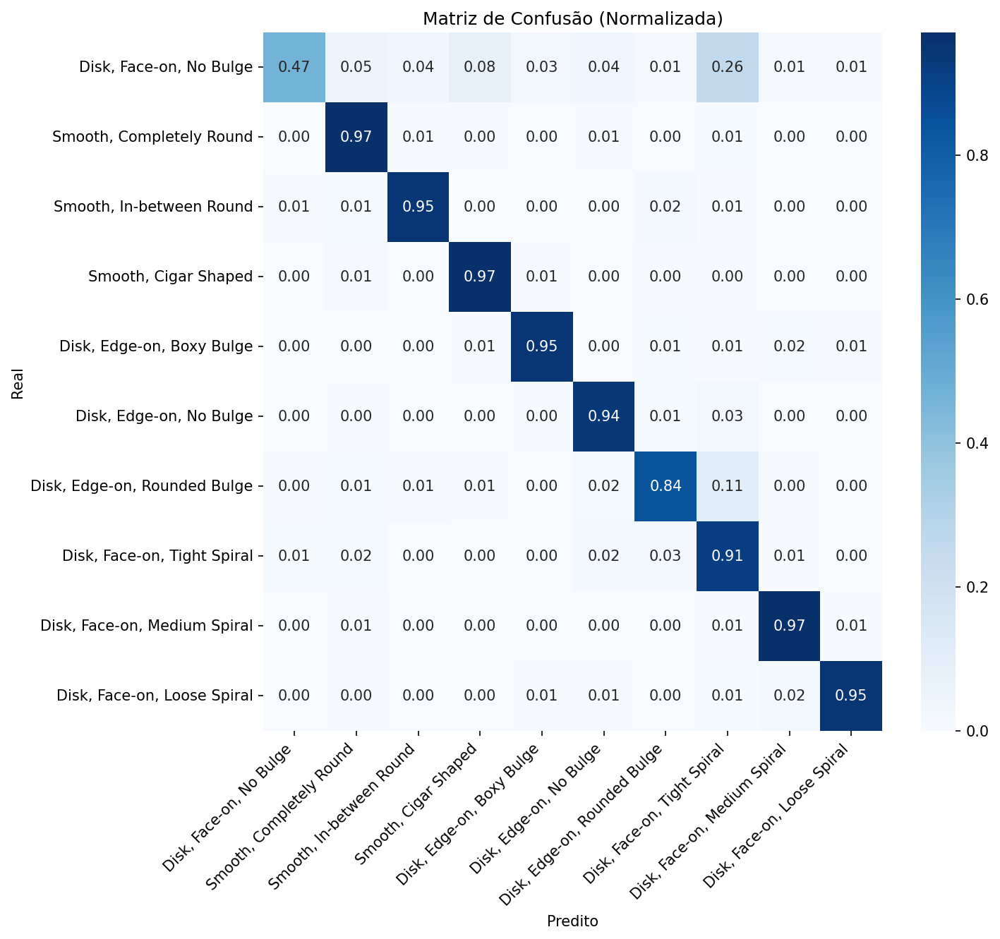
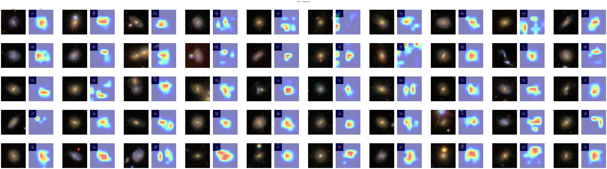
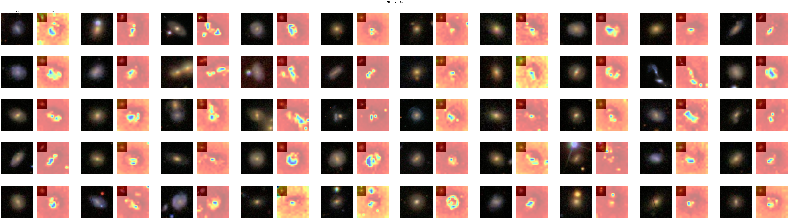

# explain-me-dnb

## 1) Resumo rápido (o que mais importa)

- O **dataset híbrido** usado nos melhores resultados do projeto é a versão `sdss_hibrido`, baseada em **balanceamento de classes**.
- Na implementação atual, esse híbrido é `SMOTE + undersampling`, mas no caso do SDSS ele acaba com a **mesma distribuição final** do `sdss_smote` (todas as classes com 6997 amostras).
- O **VGG16** é o modelo mais forte em acurácia no benchmark principal: **96.70%** em `sdss/hibrido` (run `vgg16_sdss_hibrido_ep50_20260502_221730`).
- O ganho do híbrido foi grande: VGG16 saiu de **89.38% (raw)** para **96.70% (hibrido)**.

---

## 2) O que é o dataset híbrido neste projeto

No código, o híbrido vem de:

- `pre_processamento/balanceamento.py` → `BalanceadorHibrido`
- implementação: primeiro `BalanceadorSMOTE`, depois `BalanceadorUndersampling`

```python
imgs_smote, rots_smote = BalanceadorSMOTE(self.semente).balancear(imagens, rotulos)
return BalanceadorUndersampling(self.semente).balancear(imgs_smote, rots_smote)
```

### Distribuição real dos datasets (inspecionado no projeto)

| Dataset | N total | shape | menor classe | maior classe |
|---|---:|---|---:|---:|
| `sdss` | 21785 | (69,69,3) | 17 | 6997 |
| `sdss_smote` | 69970 | (69,69,3) | 6997 | 6997 |
| `sdss_hibrido` | 69970 | (69,69,3) | 6997 | 6997 |
| `sdss_undersampling` | 170 | (69,69,3) | 17 | 17 |
| `decals` | 17736 | (256,256,3) | 334 | 2645 |
| `fusao` | 39521 | (224,224,3) | 1868 | 8937 |

**Leitura prática:** `sdss_hibrido` e `sdss_smote` ficaram iguais em distribuição (neste snapshot), então o ganho de acurácia está fortemente ligado ao rebalanceamento sintético do SDSS.

> Importante: **híbrido (`sdss_hibrido`)** não é a mesma coisa que **fusão (`fusao.h5`)**.  
> `hibrido` = estratégia de balanceamento de classes.  
> `fusao` = mistura de amostras SDSS + DECaLS redimensionadas para 224.

---

## 3) SMOTE dos datasets (como funciona aqui)

SMOTE gera amostras sintéticas para classes minoritárias por interpolação linear no espaço de features:

\[
x_{novo} = x_i + \alpha (x_{vizinho} - x_i), \quad \alpha \in [0,1]
\]

No projeto:

- flatten da imagem para vetor (`reshape`)
- vizinhos por `NearestNeighbors` (`k=5` por padrão)
- geração até igualar a classe majoritária
- clamp para `[0,255]` e cast para dtype original

Arquivo-base: `pre_processamento/balanceamento.py` (`BalanceadorSMOTE`).

### Quando usar no projeto

- SMOTE/híbrido ajudam muito quando há classe extremamente rara (como SDSS, classe com 17 amostras).
- undersampling puro derruba muito o volume total de dados (`sdss_undersampling` tem só 170 amostras).

---

## 4) O VGG16 neste projeto (arquitetura e treino)

### Modelo

- Definido em `modelos/vgg16/modelo.py`
- Backbone: `timm.create_model("vgg16", pretrained=True, num_classes=10)`
- XAI: Grad-CAM com camada alvo `features.28`

### Pipeline de treino padrão

Arquivo: `modelos/vgg16/treino.py` + utilitário `modelos/_transfer_learning.py`

1. **Split estratificado** 70/15/15 (`dividir_estratificado`)
2. **Stage 1**: backbone congelado, treina cabeça
3. **Stage 2**: backbone descongelado com LR menor
4. Early stopping + Cosine scheduler + checkpoint do melhor `val_acc`

### Hiperparâmetros relevantes (config)

`config.yaml` (seção `modelos.vgg16`):

- `batch_size: 16`
- `lr_cabeca: 1e-3`
- `lr_backbone: 1e-4`
- `epocas_congelado: 5`
- `paciencia_early_stop: 5`
- `label_smoothing: 0.05`
- `distilacao_temperatura: 4.0`
- `distilacao_alpha: 0.7`

### Fine-tuning e distilação

- Fine-tuning dedicado: `modelos/vgg16/finetuning.py` (carrega checkpoint prévio e treina tudo desde a época 1 com LR baixo)
- Distilação: `modelos/vgg16/distilacao.py` (professor ResNet50, loss hard+soft com temperatura)

---

## 5) Benchmark importante (VGG16 e top 3)

Fontes: `docs/analise-2.md` e `docs/vgg16/benchmarks/relatorio.md`.

### Top 3 por melhor run

| Rank | Modelo | Dataset | val_acc |
|---|---|---|---:|
| 1 | VGG16 | hibrido | **96.70%** |
| 2 | ResNet50 | hibrido | **96.45%** |
| 3 | EfficientNet-B0 | raw | **87.82%** |

### Matriz VGG16 × Datasets (pontos centrais)

- Melhor in-distribution: `t2` (SDSS/hibrido) = **0.9679**
- Cross-dataset com treino em fusão:
  - `t4 -> SDSS` = **0.9162**
  - `t4 -> DECaLS` = **0.9071**

---

## 6) Imagens (importadas no documento)

### Curvas de treino








### Matriz de confusão (VGG16)



### XAI (amostras)





---

## 7) Conclusões objetivas

1. O **híbrido** (SMOTE + undersampling) foi decisivo para desempenho alto em SDSS.
2. O **VGG16** é o melhor em acurácia absoluta no cenário principal.
3. O pipeline de **fusão** melhora generalização cruzada, mas não bate o SDSS/híbrido em in-distribution.
4. Para evolução imediata, o ponto crítico é comparar explicitamente `hibrido` vs `smote` em múltiplos modelos, já que hoje ambos ficaram com distribuição final idêntica no SDSS.

